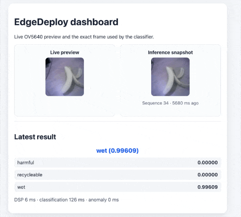

# EdgeDeploy GS

[English](README.md) | [中文](README.zh-CN.md)

EdgeDeploy GS 是运行在 ESP32-S3 上的边缘视觉固件：它通过 OV5640
摄像头采集原生 128×128 JPEG 图像，提供本地 Wi-Fi 推理网页，并在设备端
运行 MobileNetV1 垃圾分类模型。

## 演示

### 实时推理



### 运行健康监控


## 主要功能

- 采集 OV5640 原生 128×128 JPEG，并提供 MJPEG 实时预览。
- 在固定到 CPU1 的 FreeRTOS 任务中周期性运行 MobileNetV1 推理。
- 支持三个垃圾类别：`harmful`、`recycleable` 和 `wet`。
- ESP32-S3 自建 SoftAP，并在 `http://192.168.4.1/` 提供推理网页。
- 同一网页展示实时预览、实际参与推理的图像、各类别分数、最终结果和耗时。
- 使用本机 Python 工具连续采集数据集，无需重新构建固件。
- 直播、单帧拍照和推理通过统一的摄像头帧所有权机制安全协作。
- 网页按需开启运行健康任务，展示推理进度、任务栈余量以及内存趋势。

## 环境与硬件要求

### 硬件

- 配有 16 MB Flash 和 Octal PSRAM 的 ESP32-S3。
- 按本项目引脚配置连接的 OV5640 摄像头。

### 软件

- ESP-IDF 5.5.4。
- Python 3，用于本机数据集采集工具和主机测试。
- `espressif/esp32-camera` 2.1.7，由 ESP-IDF Component Manager 解析。

`esp_http_server` 已包含在 ESP-IDF 中。项目自有的 `HTTP_CAPTURE` 组件和
模型自带的 ESP-NN 内核不需要额外安装 Registry 组件。

## 工作原理

### 摄像头采集

固件将 OV5640 配置为 `PIXFORMAT_JPEG`、`FRAMESIZE_128X128`、JPEG 质量
12、两个 DRAM 帧缓冲区，并使用最新帧采集模式。摄像头组件约定单张 JPEG
最大为 8,192 字节；使用帧之前会检查格式、尺寸、数据指针和长度。

`CAMERA` 组件统一管理取帧互斥锁，因此 HTTP 直播、单帧拍照和推理不会同时
持有同一摄像头帧。

### MobileNetV1 推理

摄像头和 SoftAP 启动后，`ei_inference` 任务每两秒在 CPU1 上运行一次，
CPU0 主要留给 Wi-Fi 和 HTTP 服务。HTTP 服务随后对外开放；健康监控默认
关闭，只在网页明确开启时创建任务。

每轮推理执行以下步骤：

1. 以 250 ms 超时获取一张原生 128×128 JPEG。
2. 保存原始 JPEG 供网页显示，并将其解码为 RGB888。
3. 使用导出模型配置的 `FIT_SHORTEST` 策略缩放到 96×96。
4. 使用 ESP-NN 内核运行 INT8 MobileNetV1 分类器。
5. 发布带序列号的结果元数据以及对应的原始 JPEG。

摄像头图像首先解码到 49,152 字节的 RGB888 缓冲区。`FIT_SHORTEST`
缩放使用另一个 49,152 字节工作区，因为它会先将 128×128 裁剪结果写入
目标工作区，再原地缩小；分类器只读取最终的 96×96 RGB 区域。

导出模型中的标签拼写为 `recycleable`，固件保留该原始拼写。当最高概率低于
导出模型设定的 0.60 阈值时，最终结果显示为 `uncertain`。

串口输出示例：

```text
I (...) inference: Timing: DSP 6 ms, classification 125 ms, anomaly 0 ms
I (...) inference: harmful: 0.00391
I (...) inference: recycleable: 0.01172
I (...) inference: wet: 0.98438
I (...) inference: Prediction: wet (0.98438)
```

MobileNetV1 分类器使用约 126 KB Tensor Arena。大块内存分配到 PSRAM，
项目使用自定义 4 MB factory 分区容纳推理运行时和生成模型。

### 运行健康监控

上电后健康监控默认关闭。网页中的 `Runtime health` 开关会动态创建不绑定核心、
优先级为 1 的 `runtime_health` 任务；关闭开关会让任务安全退出并释放任务栈。
任务开启时每秒记录推理尝试、成功、失败和连续失败次数，最近错误，最近及最大
单次执行时间，以及推理任务和健康任务的栈高水位；同时采样内部内存和 PSRAM
的当前剩余量、历史最小剩余量及最大连续空闲块。

网页每秒请求一次健康快照，同时续期板端 10 秒租约。若网页被直接关闭、切到
后台太久或 Wi-Fi 中断，租约到期后健康任务会自动退出。趋势图只保留浏览器中
最近 60 个不同序列，不在板端保存历史，也不写入 Flash。

快照最初处于 `starting`，首次推理有 7 秒启动宽限期。首次成功后，如果最近
成功结果超过 6 秒没有更新，或连续 3 次推理失败，状态变为 `degraded`；后续
有效样本可使状态恢复为 `healthy`。这里检测的是结果新鲜度超时和任务活性，
并不代表硬实时 Deadline 保证。当前版本只提供快照并记录状态迁移日志，不会
自动重启任务、复位设备或喂硬件看门狗。

## 配置 SoftAP

项目默认配置如下：

| 配置项 | 默认值 |
| --- | --- |
| SSID | `ESP32S3-CAPTURE` |
| 密码 | `12345678` |
| 信道 | `1` |
| 最大连接数 | `1` |

如需修改，运行：

```bash
idf.py menuconfig
```

进入 `Example Configuration` 修改 SoftAP 配置。`sdkconfig.defaults` 中的
默认值在执行 `idf.py set-target esp32s3` 后仍会保留；只有需要本机覆盖时才
使用 `menuconfig`。

## 构建、烧录与串口监视

激活 ESP-IDF 5.5.4 后运行：

```bash
idf.py set-target esp32s3
idf.py build
idf.py -p /dev/cu.YOUR_PORT flash monitor
```

使用 `Ctrl-]` 退出串口监视器。

启动成功后，串口会输出摄像头 PID、SoftAP 地址、推理任务状态以及：

```text
Image preview ready at http://192.168.4.1/
```

## 使用推理网页

1. 使用电脑或手机连接配置好的 ESP32-S3 SoftAP。
2. 打开 `http://192.168.4.1/`。
3. 左侧会自动启动原生 MJPEG 实时预览。
4. 右侧显示最近一次推理实际使用的 128×128 JPEG。
5. 下方显示最终预测、所有类别分数和推理耗时。
6. 需要时打开 `Runtime health` 开关，查看当前指标和最近 60 秒趋势；关闭后板端
   健康任务停止。

连接这个独立热点时暂时失去普通互联网连接属于正常现象。网页每秒轮询一次
推理元数据，并按序列号请求匹配的 JPEG。元数据与图像独立更新：如果图像
暂时加载失败，网页会保留上一张有效快照，同时继续刷新结果并重试图像。
实时预览发生流错误后也会自动重连。

## 本机连续采集数据集

本机 Python 控制台使用固件已有的 HTTP API，因此连续采集不需要重新构建
固件。先让 Mac 连接 ESP32 SoftAP，再在项目根目录运行：

```bash
python3 dataset_capture_server.py
```

然后：

1. 打开 `http://127.0.0.1:8000`。
2. 输入数据集名称和拍照间隔。
3. 点击“开始连续拍照”。
4. 完成后点击“停止并保存”。
5. JPEG 文件和 `metadata.csv` 位于 `data/<数据集名称>/`。

网页会保持 MJPEG 预览连接，并显示最新保存的 JPEG 和最近 30 张缩略图。
30 张限制只作用于网页图库和浏览器内存，所有成功采集的图片仍会完整保存到
磁盘，因此单个类别采集 400–600 张图片不会被截断。

## HTTP API

| 接口 | 说明 |
| --- | --- |
| `GET /capture` | 返回一张新的 `image/jpeg`。 |
| `GET /api/status` | 返回摄像头状态、采集计数、最近 JPEG 长度、剩余 Heap 和 PSRAM。 |
| `GET /api/health` | 关闭时返回 `{"enabled":false,"ready":false,"state":"off"}`；开启后续期 10 秒租约并返回启动状态或完整快照。 |
| `POST /api/health/control` | 接收 `{"enabled":true}` 或 `{"enabled":false}`，动态启动或停止健康任务。 |
| `GET /api/inference` | 返回最近一次预测、动态类别分数、耗时、JPEG 长度、序列号和更新时间；首次结果前返回 `{"ready":false}`。 |
| `GET /api/inference/image?sequence=N` | 返回当前推理序列对应的 JPEG；过期序列返回 HTTP 409。 |

可直接检查单帧接口：

```bash
curl -D - http://192.168.4.1/capture -o capture.jpg
file capture.jpg
```

响应应包含 `Content-Type: image/jpeg`、`X-Frame-Width: 128` 和
`X-Frame-Height: 128`。

可通过以下命令开启、查看并关闭运行健康监控：

```bash
curl -X POST -H 'Content-Type: application/json' \
  -d '{"enabled":true}' http://192.168.4.1/api/health/control
curl http://192.168.4.1/api/health
curl -X POST -H 'Content-Type: application/json' \
  -d '{"enabled":false}' http://192.168.4.1/api/health/control
```

## 验证

运行全部主机行为测试和回归测试：

```bash
python3 -m unittest discover -s tests -v
```

主机测试和固件构建成功只能证明软件契约及编译通过；完整硬件验收还需要确认：

- OV5640 被正确识别，SoftAP 能够持续被搜索到。
- 三个类别概率每两秒输出一次，且没有任务看门狗警告。
- 已知样本能够得到预期分类。
- 同一序列下，网页快照、网页分数和串口输出一致。
- 长时间重复运行时，实时预览和推理仍能正常响应。
- Heap、PSRAM 和摄像头帧缓冲区保持稳定。
